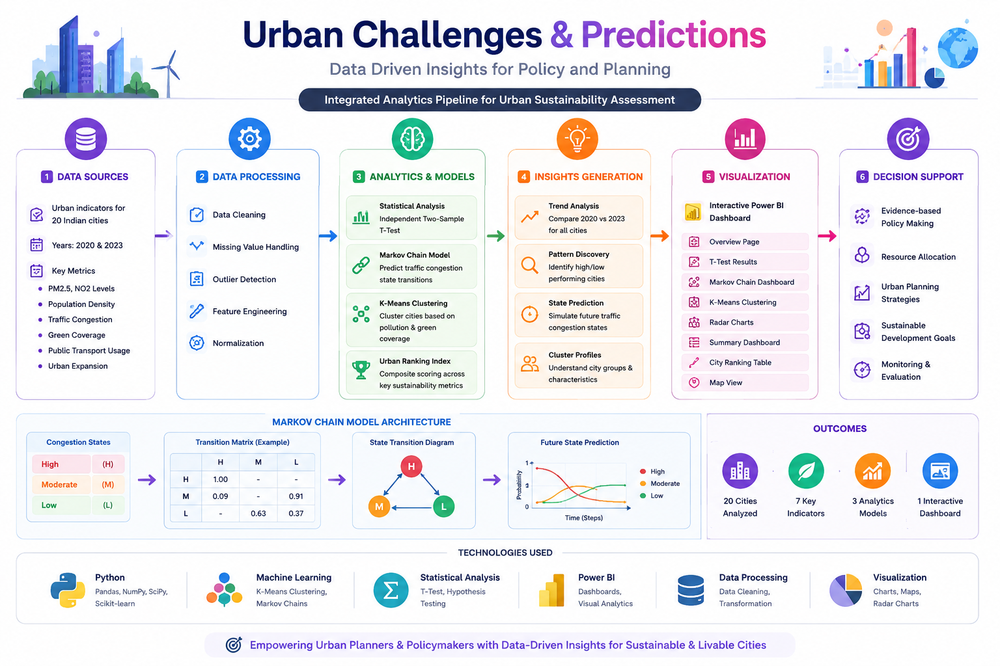
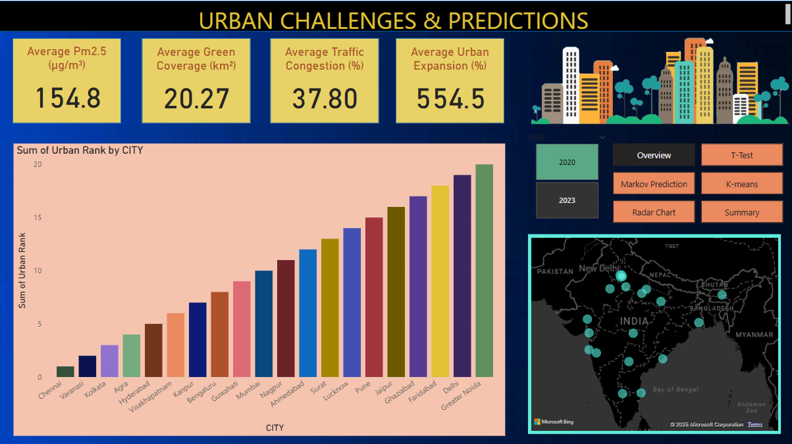
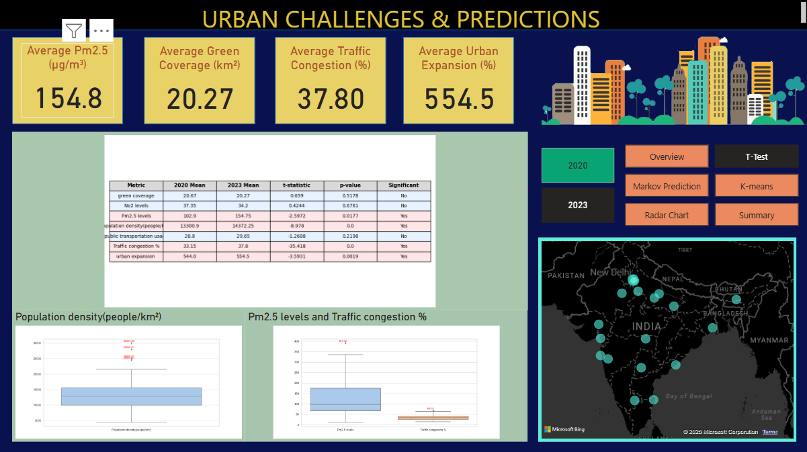
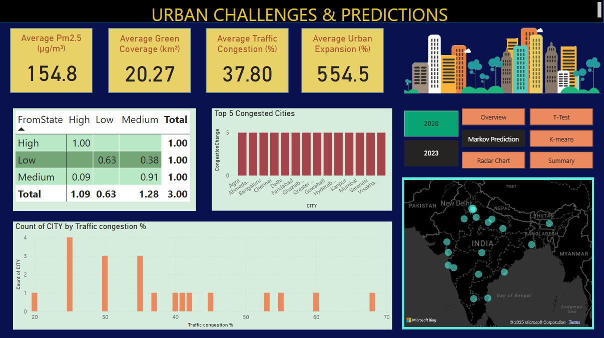
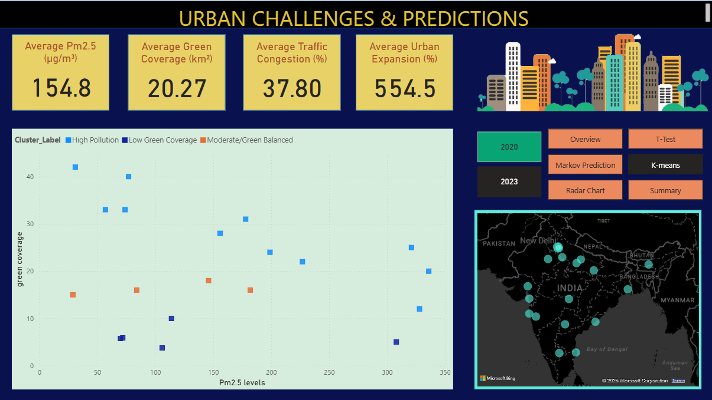
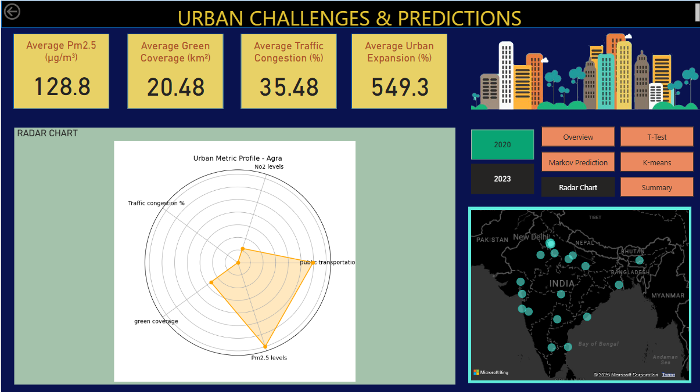
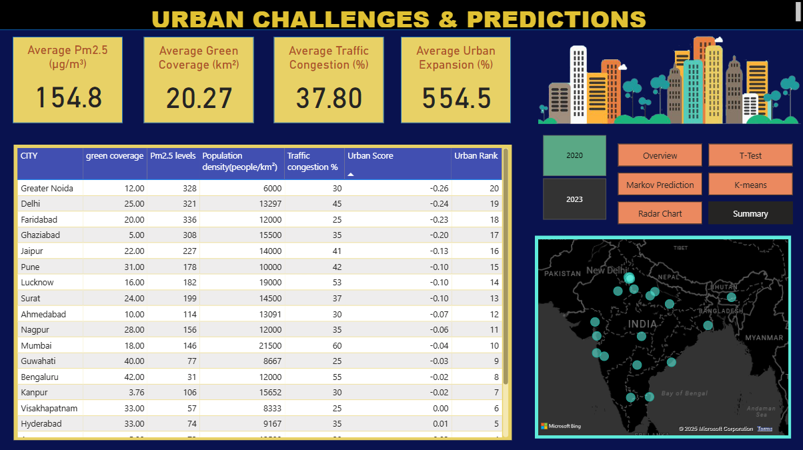

# Urban Sustainability Analytics

Data-driven urban sustainability analysis and prediction framework integrating statistical testing, machine learning, predictive modeling, and interactive Power BI dashboards to support evidence-based urban planning and policy decisions.

**Presented at ICCCNT 2025, IIT Indore**

---

# Overview

Urban sustainability challenges such as traffic congestion, pollution, population growth, and declining green spaces require data-driven approaches for effective planning.

This project analyzes sustainability indicators across 20 Indian cities by combining:

- Statistical hypothesis testing
- K-Means clustering
- Markov Chain prediction
- Urban ranking methodologies
- Interactive Power BI dashboards

The framework transforms raw urban data into actionable insights for policymakers and planners.

---

# System Architecture

  

The complete analytics pipeline integrates data collection, preprocessing, statistical analysis, machine learning models, predictive analytics, and interactive visualization.

---

# Methodology

## Data Collection

Urban indicators collected for 20 Indian cities:

- PM2.5 Levels
- NO₂ Levels
- Population Density
- Traffic Congestion
- Green Coverage
- Public Transport Usage
- Urban Expansion

Data spans:

- 2020
- 2023

---

## Data Processing

- Data Cleaning
- Missing Value Handling
- Outlier Detection
- Min-Max Normalization
- Feature Engineering

---

## Statistical Analysis

### Independent T-Test

Evaluates whether urban indicators changed significantly between 2020 and 2023.

Metrics analyzed:

- Air Quality
- Traffic Congestion
- Population Density
- Green Coverage
- Urban Expansion
- Public Transport Usage

---

## Markov Chain Prediction

Traffic congestion states are categorized as:

- Low
- Moderate
- High

Markov Chains model transitions between congestion states and predict future urban traffic trends.

---

## K-Means Clustering

Cities are grouped based on:

- PM2.5 Concentration
- Green Coverage

Resulting cluster categories include:

- High Pollution
- Low Green Coverage
- Moderate/Balanced
- Low Pollution & High Green Coverage

---

## Urban Ranking Index

A weighted sustainability score developed using:

- Population Density
- Traffic Congestion
- Public Transportation Usage
- PM2.5 Levels

The ranking provides an overall assessment of city performance.

---

# Dashboard Overview

  

The main dashboard provides a consolidated view of urban sustainability metrics, rankings, and trends.

---

# Statistical Testing Dashboard

  

Highlights statistically significant changes in sustainability indicators between 2020 and 2023.

---

# Markov Chain Dashboard

  

Visualizes congestion-state transitions and future traffic predictions using probabilistic modeling.

---

# K-Means Clustering Dashboard

  

Clusters cities according to pollution and green coverage characteristics, revealing sustainability patterns.

---

# Radar Chart Dashboard

  

Provides multidimensional sustainability profiles for individual cities.

---

# Urban Ranking Dashboard

  

Ranks cities using a composite urban sustainability score derived from multiple indicators.

---

# Key Findings

- Population density increased significantly between 2020 and 2023.
- Traffic congestion worsened across multiple cities.
- PM2.5 levels showed notable changes.
- Urban expansion increased significantly.
- Cities exhibit distinct sustainability profiles.
- Traffic congestion dynamics can be modeled effectively using Markov Chains.
- K-Means clustering reveals meaningful sustainability groupings.

---

# Technologies Used

| Category | Tools |
|-----------|--------|
| Programming | Python |
| Analytics | Pandas, NumPy |
| Statistics | SciPy |
| Machine Learning | Scikit-Learn |
| Visualization | Matplotlib |
| Dashboarding | Power BI |
| Clustering | K-Means |
| Predictive Modeling | Markov Chains |

---

# Conference Publication

**Urban Challenges and Predictions – Data Driven Insights for Policy and Planning**

Presented at:

**ICCCNT 2025**
Indian Institute of Technology Indore

---

# Applications

- Urban Planning
- Smart Cities
- Sustainability Assessment
- Transportation Planning
- Environmental Monitoring
- Public Policy
- Resource Allocation
- Decision Support Systems

---

# Future Work

Potential enhancements include:

- Multi-year time-series forecasting
- Deep learning-based prediction models
- Geospatial analytics integration
- Real-time dashboard deployment
- Additional sustainability indicators
- AI-assisted policy recommendation systems

---

# Author

**Ananya**
